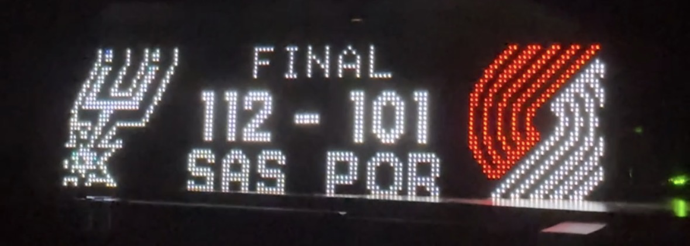

# Raspberry Pi LED Scoreboard

A Raspberry Pi powered LED matrix sports scoreboard that displays 
live scores fetched from ESPN's API onto a HUB75 RGB LED panel.

This project was inspired by the scorebug and ticker that is always present in sports broadcast and intends to bring that display to life.

## Hardware

| Item | Details |
|---|---|
| Raspberry Pi | Zero 2W (Pi 3/4 also supported, Pi 5 NOT supported) |
| Display Driver | Adafruit RGB Matrix Bonnet (#3211). There are some other options as well, I would recommend looking at the hzeller repo about adapters for more information. |
| LED Panel | 64x32 P4 HUB75 RGB matrix, 1/16 scan, you can find them for cheaper from China. This project uses 2 LED matrices |
| Power Supply | This project uses a 5V 10A power supply |

## Wiring
- GPIO mod: solder bridge between GPIO4 and GPIO18 on the Bonnet. When using the Adafruit Bonnet, it is highly recommended to solder a wire from GPIO4 and GPIO18 on the bonnet. Some more information is found at Adafruit's website here: `https://learn.adafruit.com/adafruit-rgb-matrix-bonnet-for-raspberry-pi/overview`

- Use `adafruit-hat-pwm` mapping if mod is done, `adafruit-hat` if not

## Installation

### 1. Clone the repo
`git clone --recursive git@github.com:ion-shah/raspi-led-scoreboard.git`

### 2. Set up virtual environment
`cd raspi-led-scoreboard`  
`python3 -m venv venv`  
`source venv/bin/activate`  
`pip install -r requirements.txt`  

### 3. Build and install the matrix library
`cd rpi-rgb-led-matrix`
`pip install .`
`cd ..`

### 4. Configure
`nano config.yaml` and edit for your hardware and favorite teams.  
Some teams have retro logos for aesthetics, reference the supported logo overrides table to know which logos are supported

### 5. Run
`sudo venv/bin/python main.py`

It is recommended to make a systemd service so the scoreboard persists on reboot and power off.

## Supported Sports
- NBA 
- Coming Soon: NFL, MLB, NHL, NCAA 

### Supported Retro Logos
| League | Team Abbreviation | Override Key |
|--|--| -- |
| NBA | UTAH | 2004 |
| NBA | TOR | 1995 |
| NBA | DET | 1996 |
| NBA | BKN | 2003 |
| NBA | CLE | 2016 |
| NBA | MEM | 2001 |

## Credits
- Major credits to `hzeller/rpi-rgb-led-matrix` for the display driver, the repo is installed as a submodule and I highly recommend reading through this repo to understand creating the display better. All of the display side is handled by this repo, and the project would not be possible otherwise.

- Thank you to `gidger/rpi-led-sports-scoreboard/` and `ChuckBuilds/LEDMatrix/` for their projects. These projects are really well made, and helped guide my own development process and I would recommend checking these out as they might serve your use case better.

- Thank you to `pseudo-r/Public-ESPN-API` and ESPN for the unofficial API for sports data. The pseudo-r repo has very strong doucmentation about the API and it is highly recommended.
